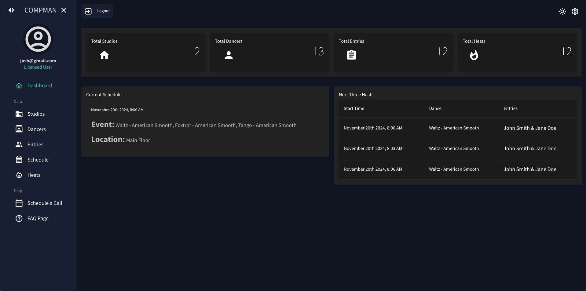

<a id="readme-top"></a>

<!-- PROJECT SHIELDS -->
<!--
*** I'm using markdown "reference style" links for readability.
*** Reference links are enclosed in brackets [ ] instead of parentheses ( ).
*** See the bottom of this document for the declaration of the reference variables
*** for contributors-url, forks-url, etc. This is an optional, concise syntax you may use.
*** https://www.markdownguide.org/basic-syntax/#reference-style-links
-->

[![Contributors][contributors-shield]][contributors-url]
[![Forks][forks-shield]][forks-url]
[![Stargazers][stars-shield]][stars-url]
[![Issues][issues-shield]][issues-url]
[![MIT License][license-shield]][license-url]
[![LinkedIn][linkedin-shield]][linkedin-url]

<!-- PROJECT LOGO -->
<br />
<div align="center">
  <a href="https://github.com/All-Purpose-Apps/compman_frontend">
    
  </a>

<h3 align="center">PROJECT COMPMAN</h3>

  <p align="center">
    A dance competition manager complete with auto generated heats, dynamic entries creation, financial system, and more. 
    <br />
    <a href="https://github.com/All-Purpose-Apps/compman_frontend"><strong>Explore the docs »</strong></a>
    <br />
    <br />
    <a href="https://github.com/All-Purpose-Apps/compman_frontend">View Demo</a>
    ·
    <a href="https://github.com/All-Purpose-Apps/compman_frontend/issues/new?labels=bug&template=bug-report---.md">Report Bug</a>
    ·
    <a href="https://github.com/All-Purpose-Apps/compman_frontend/issues/new?labels=enhancement&template=feature-request---.md">Request Feature</a>
  </p>
</div>

<!-- TABLE OF CONTENTS -->
<details>
  <summary>Table of Contents</summary>
  <ol>
    <li>
      <a href="#about-the-project">About The Project</a>
      <ul>
        <li><a href="#built-with">Built With</a></li>
      </ul>
    </li>
    <li>
      <a href="#getting-started">Getting Started</a>
      <ul>
        <li><a href="#prerequisites">Prerequisites</a></li>
        <li><a href="#installation">Installation</a></li>
      </ul>
    </li>
    <li><a href="#usage">Usage</a></li>
    <li><a href="#roadmap">Roadmap</a></li>
    <li><a href="#contributing">Contributing</a></li>
    <li><a href="#license">License</a></li>
    <li><a href="#contact">Contact</a></li>
    <li><a href="#acknowledgments">Acknowledgments</a></li>
  </ol>
</details>

<!-- ABOUT THE PROJECT -->

## About The Project

 

<p align="right">(<a href="#readme-top">back to top</a>)</p>

### Built With

MERN STACK

- [![Mongo][Mongo]][Mongo-url]
- [![Express][Express]][Express-url]
- [![React][React.js]][React-url]
- [![Node][Node]][Node-url]
- [![MaterialUI][MaterialUI]][MaterialUI-url]
- [![Firebase][Firebase]][Firebase-url]
- [![Redux][Redux]][Redux-url]
- [![Vite][Vite]][Vite-url]

<p align="right">(<a href="#readme-top">back to top</a>)</p>

<!-- GETTING STARTED -->

## Getting Started

This is an example of how you may give instructions on setting up your project locally.
To get a local copy up and running follow these simple example steps.

### Prerequisites

This is an example of how to list things you need to use the software and how to install them.

- npm

  ```sh
  npm install npm@latest -g
  ```

- npm
  ```sh
  pnpm add -g pnpm
  ```

### Installation

1. Get a free login for testing at https://www.allpurposeapps.app
2. Clone the repo
   ```sh
   git clone https://github.com/All-Purpose-Apps/compman_frontend.git
   ```
3. Install NPM packages
   ```sh
   pnpm install
   ```
4. Change git remote url to avoid accidental pushes to base project
   ```sh
   git remote set-url origin All-Purpose-Apps/compman_frontend
   git remote -v # confirm the changes
   ```

<p align="right">(<a href="#readme-top">back to top</a>)</p>

<!-- USAGE EXAMPLES -->

## Usage

Use this space to show useful examples of how a project can be used. Additional screenshots, code examples and demos work well in this space. You may also link to more resources.

_For more examples, please refer to the [Documentation](https://example.com)_

<p align="right">(<a href="#readme-top">back to top</a>)</p>

<!-- ROADMAP -->

## Roadmap

- [ ] Feature 1
- [ ] Feature 2
- [ ] Feature 3
  - [ ] Nested Feature

See the [open issues](https://github.com/All-Purpose-Apps/compman_frontend/issues) for a full list of proposed features (and known issues).

<p align="right">(<a href="#readme-top">back to top</a>)</p>

<!-- CONTRIBUTING -->

## Contributing

Contributions are what make the open source community such an amazing place to learn, inspire, and create. Any contributions you make are **greatly appreciated**.

If you have a suggestion that would make this better, please fork the repo and create a pull request. You can also simply open an issue with the tag "enhancement".
Don't forget to give the project a star! Thanks again!

1. Fork the Project
2. Create your Feature Branch (`git checkout -b feature/AmazingFeature`)
3. Commit your Changes (`git commit -m 'Add some AmazingFeature'`)
4. Push to the Branch (`git push origin feature/AmazingFeature`)
5. Open a Pull Request

<p align="right">(<a href="#readme-top">back to top</a>)</p>

### Top contributors:

<a href="https://github.com/All-Purpose-Apps/compman_frontend/graphs/contributors">
  
</a>

<!-- LICENSE -->

## License

Distributed under the MIT License. See `LICENSE.txt` for more information.

<p align="right">(<a href="#readme-top">back to top</a>)</p>

<!-- CONTACT -->

## Contact

Your Name - [@twitter_handle](https://twitter.com/twitter_handle) - email@email_client.com

Project Link: [https://github.com/All-Purpose-Apps/compman_frontend](https://github.com/All-Purpose-Apps/compman_frontend)

<p align="right">(<a href="#readme-top">back to top</a>)</p>

<!-- ACKNOWLEDGMENTS -->
<!--
## Acknowledgments

- []()
- []()
- []() -->

<p align="right">(<a href="#readme-top">back to top</a>)</p>

<!-- MARKDOWN LINKS & IMAGES -->
<!-- https://www.markdownguide.org/basic-syntax/#reference-style-links -->

[contributors-shield]: https://img.shields.io/github/contributors/All-Purpose-Apps/compman_frontend.svg?style=for-the-badge
[contributors-url]: https://github.com/All-Purpose-Apps/compman_frontend/graphs/contributors
[forks-shield]: https://img.shields.io/github/forks/All-Purpose-Apps/compman_frontend.svg?style=for-the-badge
[forks-url]: https://github.com/All-Purpose-Apps/compman_frontend/network/members
[stars-shield]: https://img.shields.io/github/stars/All-Purpose-Apps/compman_frontend.svg?style=for-the-badge
[stars-url]: https://github.com/All-Purpose-Apps/compman_frontend/stargazers
[issues-shield]: https://img.shields.io/github/issues/All-Purpose-Apps/compman_frontend.svg?style=for-the-badge
[issues-url]: https://github.com/All-Purpose-Apps/compman_frontend/issues
[license-shield]: https://img.shields.io/github/license/All-Purpose-Apps/compman_frontend.svg?style=for-the-badge
[license-url]: https://github.com/All-Purpose-Apps/compman_frontend/blob/master/LICENSE.txt
[linkedin-shield]: https://img.shields.io/badge/-LinkedIn-black.svg?style=for-the-badge&logo=linkedin&colorB=555
[linkedin-url]: https://linkedin.com/in/linkedin_username
[product-screenshot]: images/screenshot.png
[React.js]: https://img.shields.io/badge/React-20232A?style=for-the-badge&logo=react&logoColor=61DAFB
[React-url]: https://reactjs.org/
[MaterialUI]: https://img.shields.io/badge/Material%20UI-007FFF?style=for-the-badge&logo=mui&logoColor=white
[MaterialUI-url]: https://mui.com/
[Express]: https://img.shields.io/badge/Express%20js-000000?style=for-the-badge&logo=express&logoColor=white
[Express-url]: https://expressjs.com/
[Mongo]: https://img.shields.io/badge/MongoDB-4EA94B?style=for-the-badge&logo=mongodb&logoColor=white
[Mongo-url]: https://www.mongodb.com/
[Node]: https://img.shields.io/badge/Node%20js-339933?style=for-the-badge&logo=nodedotjs&logoColor=white
[Node-url]: https://nodejs.org/en
[Firebase]: https://img.shields.io/badge/firebase-ffca28?style=for-the-badge&logo=firebase&logoColor=black
[Firebase-url]: https://firebase.google.com/
[Redux]: https://img.shields.io/badge/Redux-593D88?style=for-the-badge&logo=redux&logoColor=white
[Redux-url]: https://redux.js.org/
[Vite]: https://img.shields.io/badge/Vite-B73BFE?style=for-the-badge&logo=vite&logoColor=FFD62E
[Vite-url]: https://vitejs.dev/
